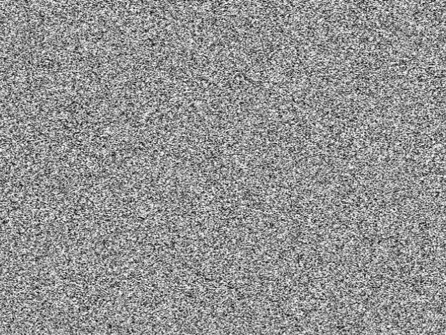
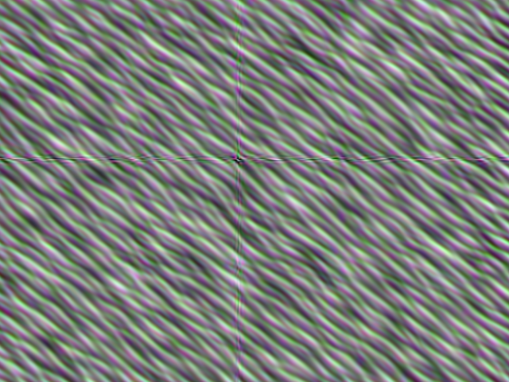

# Deep Dream for PyTorch

[TOC]

## Classifier

Trains generic classification models

- Follows generic Xception submodule throughout each layer
- Tests for convergence to prevent overfitting at each epoch
- Start with pre-trained weights for faster convergence

#### deep_dream.classifier.train

```
python3 -m deep_dream.classifier.train

# Weights read and stored at
$DEEP_DREAM_PATH/classifier/classifier.pt
```

- Parameters changed only from the script itself to ensure repeatability
- GPU compatibility enabled by default

## Dreamer

Enhances features that models identify within example images

- Uses InceptionV3 model with pre-trained weights
- Trains the image instead of the model through gradient ascent
- Creates surreal special effects

#### deep_dream.dreamer.classize_image

```
python3 -m deep_dream.dreamer.classize_image --image <path_to_image>
```

Input image:



Output image:



- This is what the last layer in InceptionV3 sees when given an input of white noise
- The default block specified prefers to find diagonal Twizzler shaped lines

#### deep_dream.dreamer.fractal_dream

```
python3 -m deep_dream.dreamer.fractal_dream --image <path_to_image>
```

- Outputs a series of images that can be easily turned into a mesmerizing video
- Each frame is slightly changed through gradient ascent and slightly zoomed in compared to the previous frame

## Libutensor

Provides PyTorch helper functions for other sub-packages

## Reddit Scrapping

Downloads images about specific topics for training purposes

- Scrapes sub-Reddits for images
- Subreddits are ideal for retrieving large numbers of images about extremely specific topics

- Uses selenium to automate clicking through and collecting image url's from the browser

#### deep_dream.reddit_scrapping.reddit_scrape

```
python3 -m deep_dream.reddit_scrapping.reddit_scrape

# Show number of urls collected
cat <path_to_/pics.txt> | wc -l
```

- Subreddit url is specified with the script
- Outputs a pics.txt file to store the urls

#### deep_dream.reddit_scrapping.image_download

```
cat <path_to_/pics.txt> | xargs -n 100 -I % sh -c " { python3 -m deep_dream.reddit_scrapping.image_download --link \"%\" --destination <picture_storage_location>; }

# convert all jpgs to pngs
ls -1 *.jpg | xargs -n 1 bash -c 'convert "$0" "${0%.jpg}.png"'
```

- Uses the pics.txt file to download image found with `reddit_scrape.py`
- Format of this script allows for any bash pipe of image urls to be downloaded; not specific to this repository
- Images named using checksums of the downloaded image to prevent duplicate images through reposts on different hosting platforms or in case the script must be restarted

